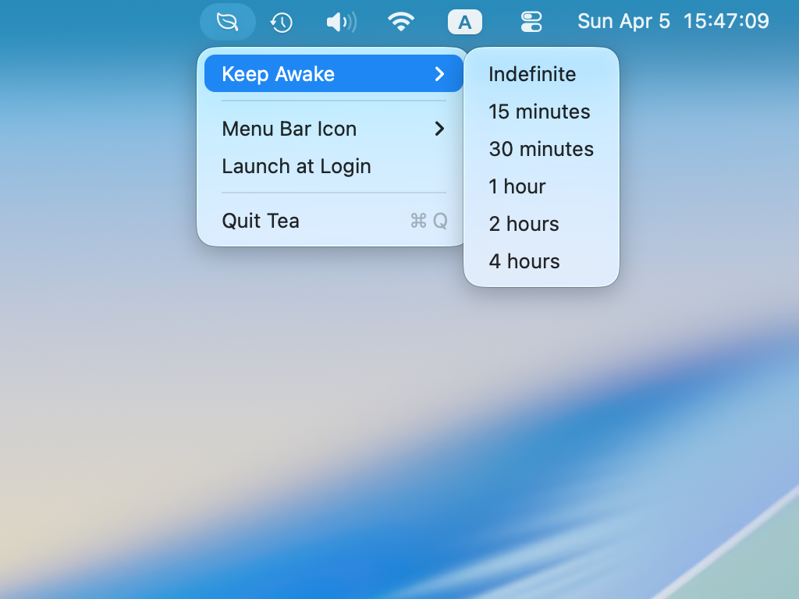
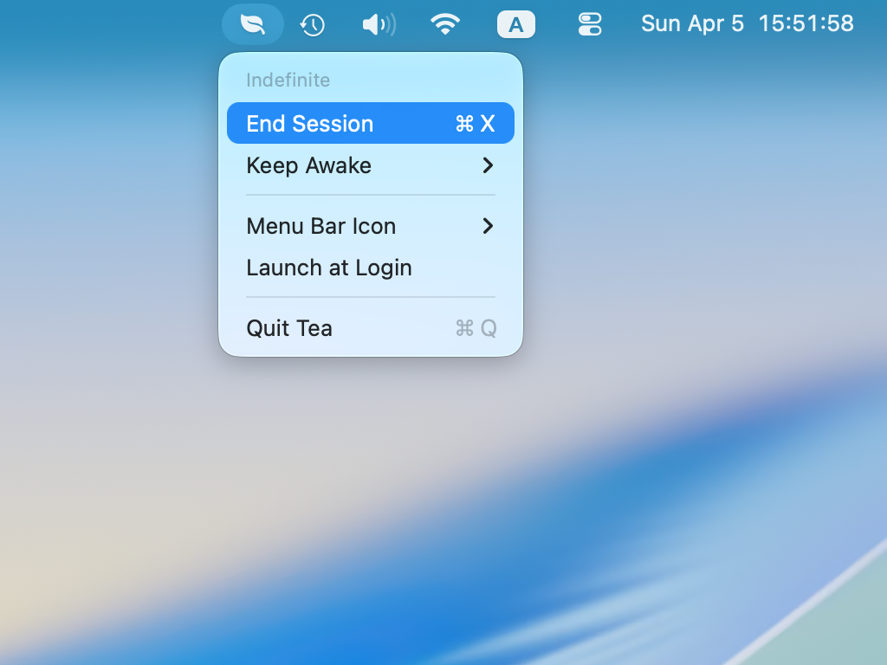
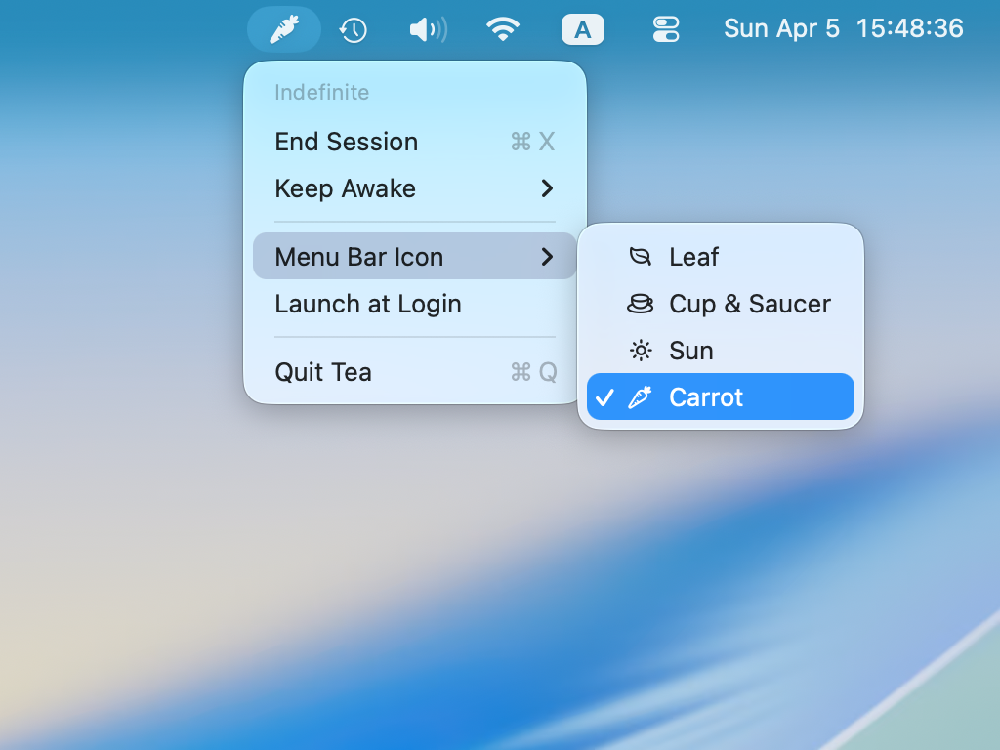

# Tea

**Tea** is an ultra-lightweight macOS menu bar app that prevents your Mac from sleeping for a duration you choose. It’s useful for presentations, downloads, or any task where automatic sleep gets in the way.

## What it does

- **Timed or indefinite “keep awake”** — Pick a duration or run until you stop it.
- **Clear session info** — See when a timed session ends, or that it is indefinite.
- **Menu bar icon** — Choose an icon style that fits your setup.
- **Keep awake on launch** — Optionally start an indefinite session when Tea opens.
- **Launch at login** — Optional; uses the system’s login items interface.

## Requirements

macOS 14 or later.

## Get it

Download from [release page](https://github.com/syaning/Tea/releases) or build from source.

## Screenshots

| Description | Preview |
|-------------|---------|
| Menu bar (idle) |  |
| Active session |  |
| Icon options |  |

## License

MIT